<div align="center">

# 🎬 Movura

[](https://flutter.dev)
[](https://dart.dev)
[](LICENSE)
[](https://flutter.dev)

**A dark-themed movie & TV show discovery app powered by TMDB. Browse trending titles, dive into
full details — cast, reviews, trailers, and similar content — all wrapped in a clean-architecture
Flutter codebase with Cubit state management.**

[✨ Features](#-features) • [📸 Screenshots](#-screenshots) • [🏗️ Architecture](#-architecture) • [🚀 Getting Started](#-getting-started) • [👤 Author](#-author)

</div>

---

## 🎥 Demo Video

<div align="center">

[](https://youtube.com/@ahmedel-bialy)

</div>

---

## 🎯 Overview

**Movura** is a Flutter entertainment app built on top of **The Movie Database (TMDB) API**. It lets
users browse trending movies and TV shows, search across both, and open a rich details screen with
cast & crew, budget/revenue stats (for movies) or season/episode stats (for TV), reviews, trailers,
and recommendations — all rendered in a premium dark, neon-accented UI.

The project was built as a **CodeAlpha Internship** task and pushed beyond the basic requirements —
adding Firebase integration, a full custom design system, shimmer loading states, and a reusable
poster-card component system used across every screen.

### 💡 Key Highlights

- 🎬 **TMDB-Powered Catalog** — Trending, top-rated movies, and top-rated TV series
- 🔍 **Debounced Search** — Multi-type search (movies, TV, people) with a smart 800ms debounce
- 📝 **Rich Details Screen** — Cast, companies/networks, images, trailers, reviews, and similar content in tabs
- 🎥 **In-App Trailer Player** — Full-screen YouTube playback with orientation handling
- 🌙 **Custom Dark Design System** — Neon-cyan accent palette with 3 custom fonts (Manrope, Montserrat, Sora)
- 💀 **Shimmer Loading States** — Skeleton loaders for grids, lists, and the details screen
- 🏗️ **Clean, Feature-Based Architecture** — `data / logic / ui` split per feature
- 🔌 **Type-Safe Networking** — Retrofit + Dio with a centralized `DioFactory`
- 🔑 **Dependency Injection** — GetIt service locator wiring services → repos → cubits
- 🔥 **Firebase Ready** — `firebase_core`, `firebase_auth`, and `cloud_firestore` wired into the app bootstrap

---

## ✨ Features

### 🏠 Home Screen
- Rotating **category cards** (Popular Movies/TV, Trending Movies/People) with a page indicator
- **Trending Now**, **Top Rated Movies**, and **Top Rated TV Series** horizontal rails, each backed by its own Cubit
- Side navigation **drawer** (Profile, Go Pro, Discover Movies, TV Series, Popular People, Logout)
- Sliver-based scroll with a floating app bar

### 🔍 Search
- Multi-type search across TMDB's `search/multi` endpoint (movies, TV shows, people)
- 800ms debounce before firing the request to avoid spamming the API on every keystroke
- Dedicated `PersonCard` for people results, alongside the shared `PosterCard` for titles
- Shimmer grid while loading, empty-state message when nothing matches

### 🎞️ Details (Movie & TV)
- Glassmorphism-style identity card over the backdrop (title, rating, runtime/status, age rating badge)
- **Movie:** budget, revenue, and runtime stats
- **TV:** average episode runtime, episode count, and season count, plus a horizontal seasons list
- Tabbed layout — **About** (cast, companies/networks, images, logos, trailers), **Reviews**, **Similar**
- "Read more / Read less" storyline text and a horizontally scrollable genre chip list
- Full-screen YouTube trailer playback with auto-hide controls in landscape

### 🎨 Design System
- Custom `AppColors` palette (blacks, neon-cyan, gold, cool gray, ice blue) shared across every widget
- Custom `AppTextStyles` built on **Manrope**, **Montserrat**, and **Sora**
- Reusable `PosterCard` composed of sub-widgets (top-left media type badge, top-right rating badge, bottom-left title card) used identically across Home, Search, and Details screens

---

## 📸 Screenshots

> Screenshots live in the `screenshots/` folder — update the paths below if you rename or move them.
> This is a temporary gallery; feel free to swap in a cleaner set once the app is fully polished.

<div align="center">

<table>
<tr>
<td align="center" style="padding: 16px 24px;">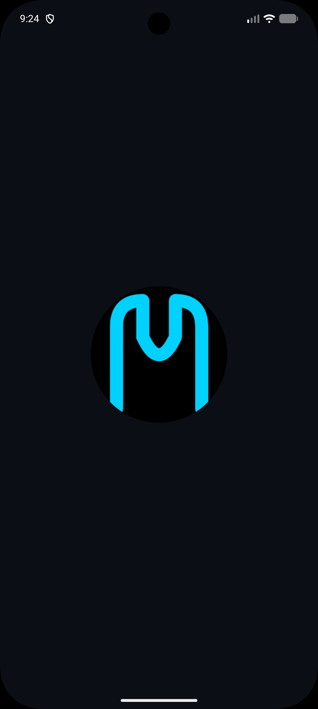<br/><sub>Splash</sub></td>
<td align="center" style="padding: 16px 24px;">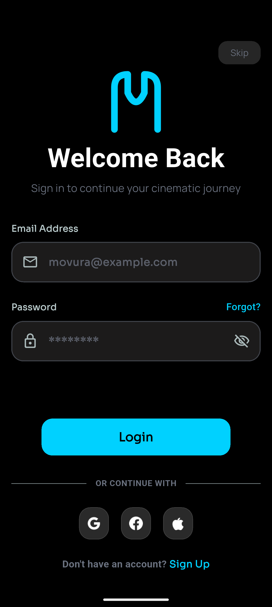<br/><sub>Login</sub></td>
<td align="center" style="padding: 16px 24px;">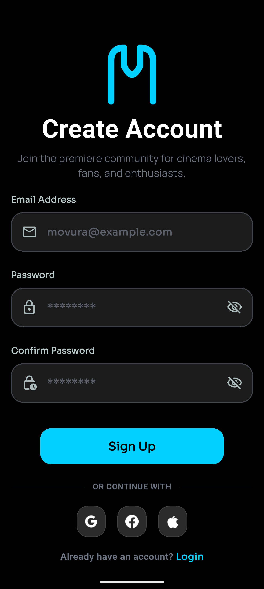<br/><sub>Sign Up</sub></td>
<td align="center" style="padding: 16px 24px;">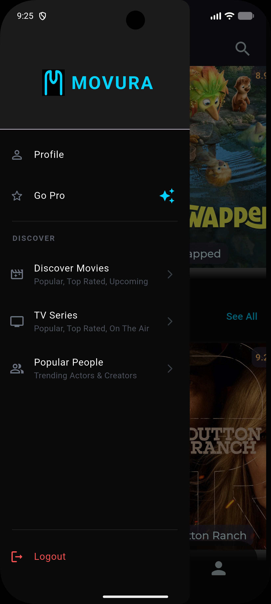<br/><sub>Side Drawer</sub></td>
</tr>
<tr>
<td align="center" style="padding: 16px 24px;">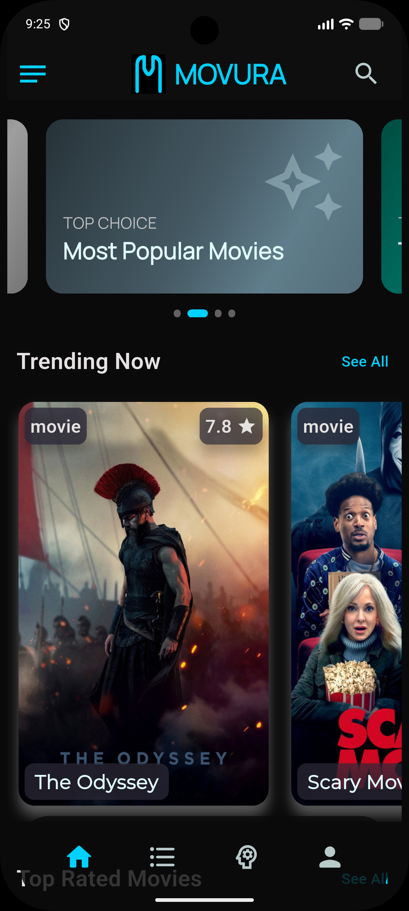<br/><sub>Home</sub></td>
<td align="center" style="padding: 16px 24px;">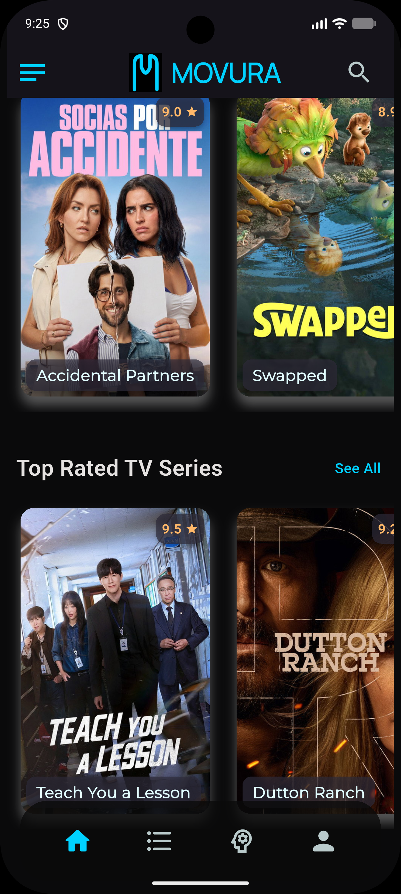<br/><sub>Home (Top Rated)</sub></td>
<td align="center" style="padding: 16px 24px;">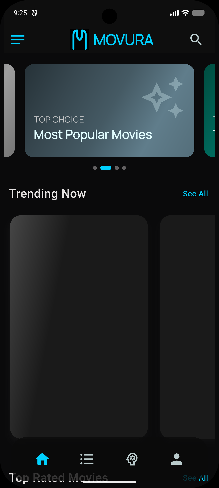<br/><sub>Home Loading</sub></td>
<td align="center" style="padding: 16px 24px;">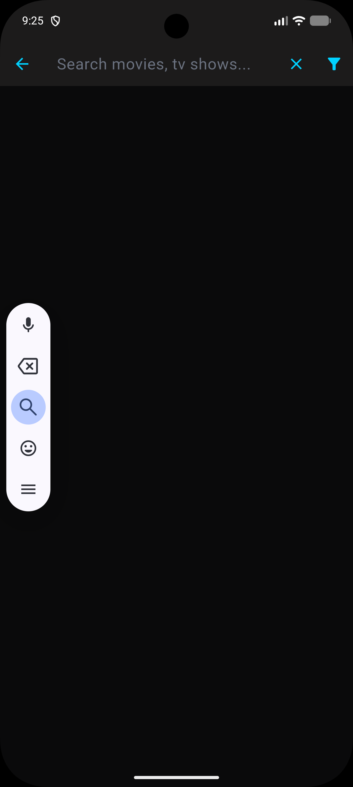<br/><sub>Search</sub></td>
</tr>
<tr>
<td align="center" style="padding: 16px 24px;">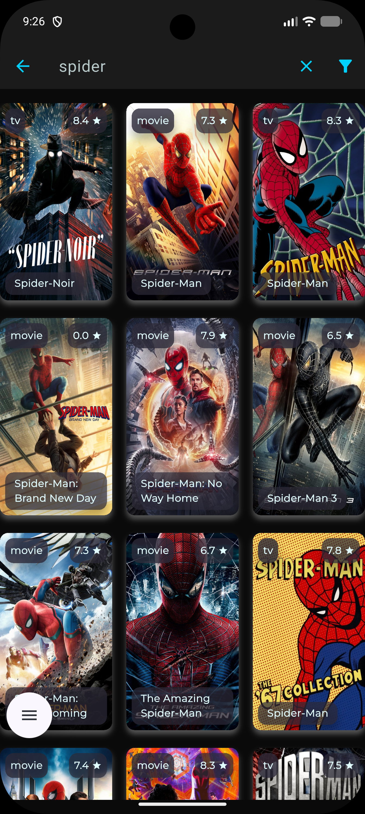<br/><sub>Search Results</sub></td>
<td align="center" style="padding: 16px 24px;">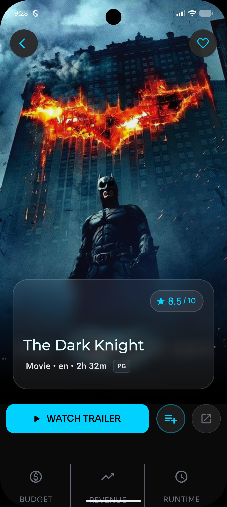<br/><sub>Movie Details</sub></td>
<td align="center" style="padding: 16px 24px;">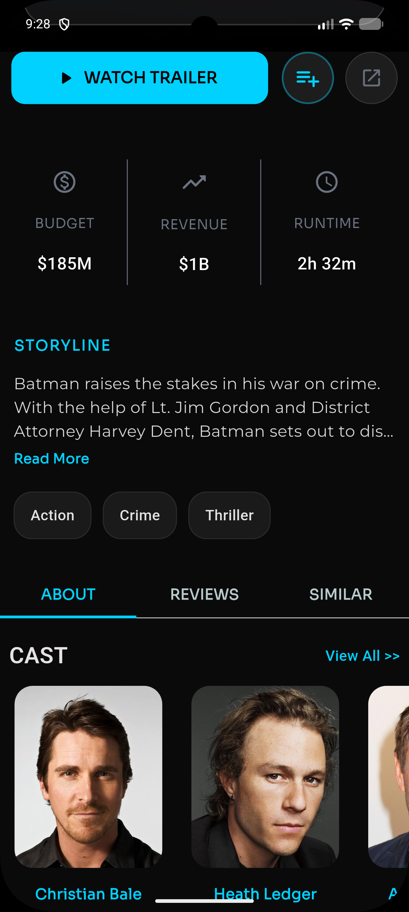<br/><sub>Movie Details (Cast)</sub></td>
<td align="center" style="padding: 16px 24px;">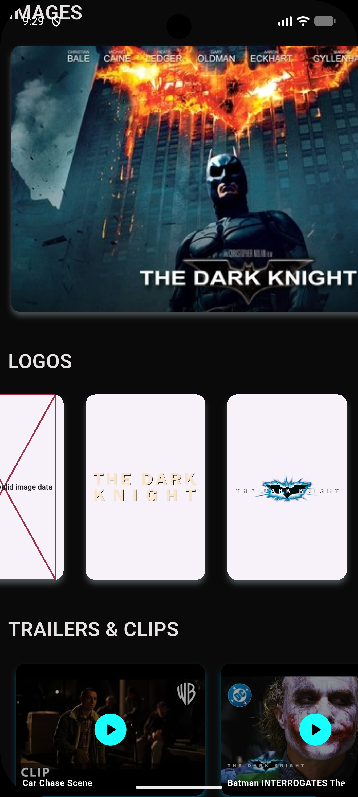<br/><sub>Movie Details (Images/Trailers)</sub></td>
</tr>
<tr>
<td align="center" style="padding: 16px 24px;">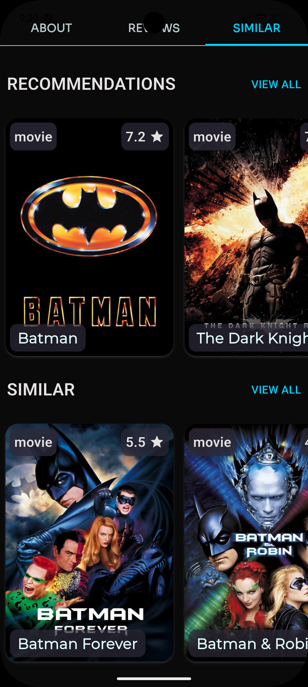<br/><sub>Movie Similar/Recommendations</sub></td>
<td align="center" style="padding: 16px 24px;">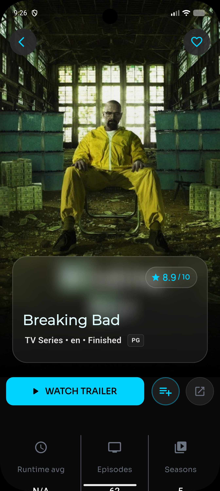<br/><sub>TV Details</sub></td>
<td align="center" style="padding: 16px 24px;">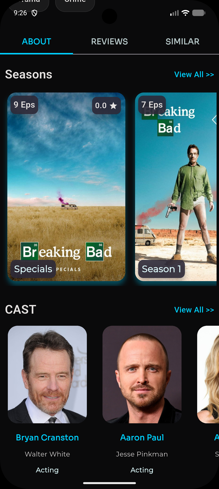<br/><sub>TV Details (Cast/Companies)</sub></td>
<td align="center" style="padding: 16px 24px;">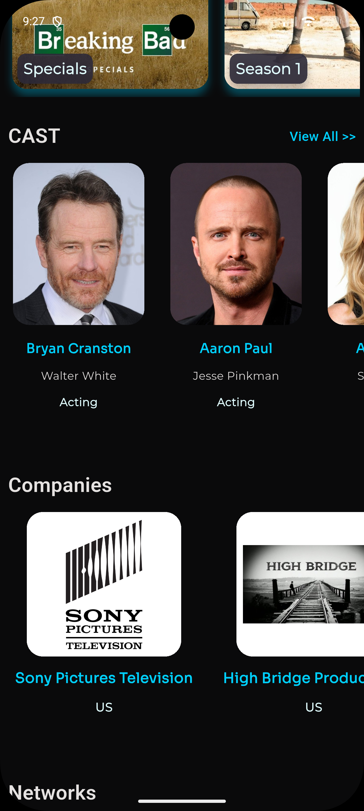<br/><sub>TV Details (Networks)</sub></td>
</tr>
<tr>
<td align="center" style="padding: 16px 24px;">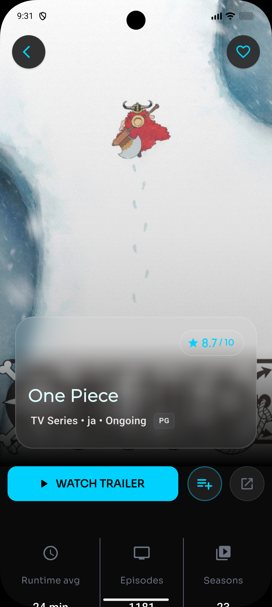<br/><sub>TV Details (Anime example)</sub></td>
<td align="center" style="padding: 16px 24px;">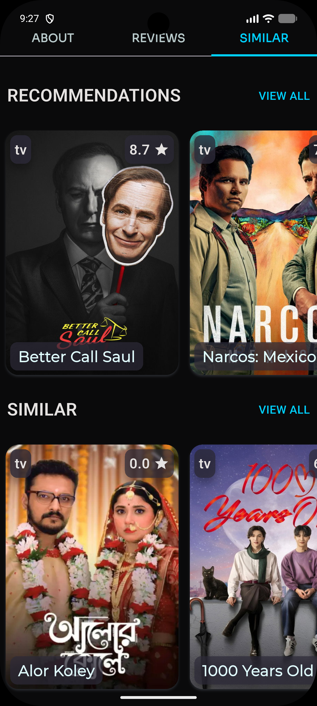<br/><sub>TV Similar/Recommendations</sub></td>
<td align="center" style="padding: 16px 24px;">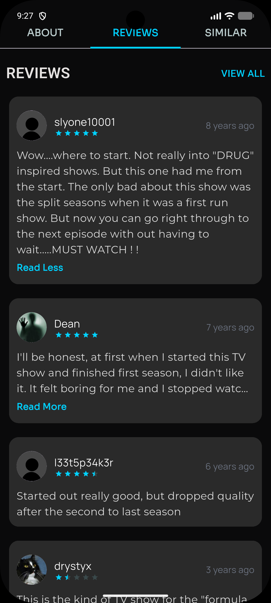<br/><sub>Reviews</sub></td>
<td align="center" style="padding: 16px 24px;">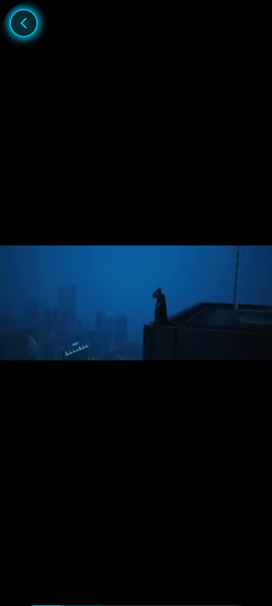<br/><sub>Trailer Player (Portrait)</sub></td>
</tr>
</table>

</div>

---

## 🛠️ Technical Stack

<div align="center">

|      Component        |             Technology              |             Purpose             |
|:----------------------:|:------------------------------------:|:--------------------------------:|
|     **Framework**      |               Flutter                |        Cross-platform UI         |
|      **Language**      |                 Dart                 |         Core development         |
|  **State Management**  |         flutter_bloc (Cubit)         |      Business logic layer        |
|    **HTTP Client**     |                  Dio                 |            Networking            |
|   **Type-Safe API**    |               Retrofit               |         API interfaces           |
|   **API Generator**    |         retrofit_generator           |        Code generation           |
|    **JSON Parsing**    | json_annotation / json_serializable  |      Model serialization         |
|    **Build System**    |             build_runner             |        Code generation           |
|   **Image Caching**    |        cached_network_image          |       Image optimization         |
|    **Video Player**    |        youtube_player_flutter        |   ^9.1.3 — Trailer playback      |
|   **Responsive UI**    |          flutter_screenutil          |        Screen adaptation         |
|      **Shimmer**       |                shimmer               |       Loading animations         |
|   **Rating Widget**    |          flutter_rating_bar          |   ^4.0.1 — 5-star review UI      |
|    **Time Format**     |                timeago                |   ^3.7.1 — Relative timestamps   |
|  **Expandable Pages**  |          expandable_page_view         |   ^1.3.0 — Synced tab/page swipe |
|  **Page Indicator**    |          smooth_page_indicator        |   ^2.0.1 — Category carousel dots|
|  **Service Locator**   |                get_it                |      Dependency injection        |
|    **Environment**     |            flutter_dotenv             |   ^6.0.1 — `.env` configuration  |
| **Backend / Auth**     | firebase_core, firebase_auth, cloud_firestore | ^4.12.1 / ^6.5.6 / ^6.7.1 |
|   **Native Splash**    |          flutter_native_splash        |          Launch screen           |
|     **App Icons**      |          flutter_launcher_icons       |          Platform icons          |
|       **Design**       |            Custom Design System       | Neon-dark theme, 3 custom fonts  |

*Version numbers shown are the ones confirmed in `pubspec.yaml`; packages without a version above are used in the code but should be double-checked against your `pubspec.yaml` for the exact pinned version.*

</div>

---

## 🏗️ Architecture

### 📁 Project Structure

```
lib/
├── main.dart                          # App entry point (Firebase, dotenv, DI bootstrap)
├── firebase_options.dart              # FlutterFire-generated platform config
│
├── core/                              # Shared layer
│   ├── models/                        # actor, company, genre, image, poster, video models
│   ├── networking/
│   │   ├── di.dart                    # GetIt service registration
│   │   └── dio_factory.dart           # Dio instance + auth headers + logging interceptor
│   ├── routing/
│   │   ├── app_router.dart            # onGenerateRoute navigation
│   │   └── arguments_model.dart       # Typed route arguments
│   ├── theming/
│   │   ├── app_colors.dart
│   │   ├── text_styles.dart
│   │   └── weights.dart
│   ├── utils/
│   │   ├── constants/                 # api_constants.dart, app_constants.dart
│   │   ├── extensions/                # date, money, rating, runtime, routing, status formatters
│   │   └── helpers/                   # spacing.dart, validators.dart, video_player.dart
│   └── widgets/                       # PosterCard system, buttons, form fields, skeletons...
│
├── features/
│   ├── auth/
│   │   └── ui/screens/                # log_in_screen.dart, sign_up_screen.dart
│   │
│   ├── home/
│   │   ├── data/                      # category_card_model, home_repo, home_web_services
│   │   ├── logic/                     # trending_content, top_rated_movies, top_rated_tv_series (Cubits)
│   │   └── ui/                        # home_screen.dart + widgets
│   │
│   ├── search/
│   │   ├── data/                      # search_repo, search_web_services
│   │   ├── logic/search/              # search_cubit.dart
│   │   └── ui/                        # custom_search_delegate.dart + widgets
│   │
│   └── details/
│       ├── data/
│       │   ├── models/movie_models/   # about_model.dart
│       │   ├── models/tv_models/      # about_tv_series_model.dart
│       │   ├── models/shared_models/  # review_model.dart, similar_model.dart
│       │   ├── repos/                 # movies_repo.dart, tv_series_repo.dart
│       │   └── webs_services/         # movie_web_services.dart, tv_web_services.dart
│       ├── logic/
│       │   ├── movie_screen_cubit/    # main_details, reviews, similar_content
│       │   └── tv_series_cubit/       # about_tv, reviews, similar_content
│       └── ui/
│           ├── screens/               # movie_details_screen, tv_series_details_screen, video_screen
│           └── widgets/               # movie_widgets/, tv_widgets/, shared_widgets/
│
assets/
├── fonts/                              # Manrope-Regular, Montserrat-Regular, Sora-Regular
└── images/                             # app icons, logos, social login icons
```

### 🎨 Color Palette

| Swatch | Name | Hex |
|:---:|:---|:---|
| 🟦 | Neon Blue | `#00D1FF` |
| 🟦 | Dark Neon Cyan | `#009191` |
| ⬛ | Jet Black | `#0A0A0A` |
| ⬛ | Onyx Black | `#2A2A2A` |
| 🟡 | Gold | `#FFB869` |
| 🔴 | Soft Red | `#E57373` |
| ⚪ | Platinum Gray | `#E5E2E1` |
| ⚪ | Ice Blue | `#E1FDFF` |

### 🔄 Data Flow

```
┌──────────────────────────────────────────────────────────┐
│                    UI (Screens & Widgets)                 │
│           BlocBuilder listens to Cubit states             │
└──────────────────────────────────────────────────────────┘
                            ↑↓
┌──────────────────────────────────────────────────────────┐
│                  Cubit (flutter_bloc)                      │
│   Initial → Loading → Loaded/Success → Failed(message)    │
└──────────────────────────────────────────────────────────┘
                            ↑↓
┌──────────────────────────────────────────────────────────┐
│                     Repository                             │
│        Thin abstraction over the web service layer        │
└──────────────────────────────────────────────────────────┘
                            ↑↓
┌──────────────────────────────────────────────────────────┐
│              Retrofit Web Service (generated)              │
│           Typed HTTP calls via a shared Dio client         │
└──────────────────────────────────────────────────────────┘
                            ↑↓
┌──────────────────────────────────────────────────────────┐
│                        TMDB API                            │
└──────────────────────────────────────────────────────────┘
```

### 🧠 State Management

Every feature follows the same **Cubit** convention: a `sealed class` state with `Initial`,
`Loading`, a success state carrying the fetched model, and a `Failed(errorMessage)` state. Cubits
are registered as **factories** in GetIt and provided per-screen via `BlocProvider` /
`MultiBlocProvider`, so each screen gets a fresh instance backed by a shared repository singleton.

---

## 🌐 API Integration

Movura consumes **The Movie Database (TMDB) API v3**.

| Endpoint | Method | Purpose |
|:---|:---:|:---|
| `trending/all/day` | `GET` | Trending movies & TV for the Home screen |
| `movie/top_rated` | `GET` | Top rated movies |
| `tv/top_rated` | `GET` | Top rated TV series |
| `search/multi` | `GET` | Multi-type search (movies, TV, people) |
| `movie/{id}` | `GET` | Movie details (with `append_to_response=credits,images,videos`) |
| `tv/{id}` | `GET` | TV series details (same `append_to_response`) |
| `movie/{id}/reviews` | `GET` | Movie reviews |
| `tv/{id}/reviews` | `GET` | TV series reviews |
| `movie/{id}` | `GET` | Similar/recommended movies (`append_to_response=similar,recommendations`) |
| `tv/{id}` | `GET` | Similar/recommended TV series |

**HTTP Client:** Dio, wrapped by Retrofit-generated interfaces, with a `DioFactory` that injects the
Bearer read-access token and `api_key` query parameter, plus a `LogInterceptor` for request/response
debugging.

---

## ⚙️ Code Generation

This project relies on `build_runner` for JSON models (`json_serializable`) and the Retrofit HTTP clients.

```bash
# Generate code once
flutter pub run build_runner build --delete-conflicting-outputs

# Watch for changes during development
flutter pub run build_runner watch --delete-conflicting-outputs
```

---

## 🚀 Getting Started

### 📋 Prerequisites

| Requirement | Purpose |
|:---:|:---|
| Flutter SDK | Framework |
| Dart SDK | Language |
| TMDB API Key & Read Access Token | [themoviedb.org](https://www.themoviedb.org/settings/api) |
| Firebase project | `firebase_core` / `firebase_auth` / `cloud_firestore` |

### 💻 Installation

```bash
# 1. Clone the repository
git clone https://github.com/ahmed-el-bialy/Movura.git
cd Movura

# 2. Install dependencies
flutter pub get

# 3. Generate code (required for models & API clients)
flutter pub run build_runner build --delete-conflicting-outputs

# 4. Set up environment variables — create a .env file at the project root:
#    TMDB_API_KEY=your_tmdb_api_key
#    TMDB_READ_TOKEN=your_tmdb_read_access_token

# 5. Set up Firebase (if you're wiring up your own project)
#    flutterfire configure

# 6. Run the app
flutter run
```

### 🔑 Environment Variables (`.env`)

```env
TMDB_API_KEY=your_tmdb_api_key
TMDB_READ_TOKEN=your_tmdb_read_access_token
```

These are read via `flutter_dotenv` in `ApiConstants` and injected into every request through `DioFactory`.

---

## 🚧 Known Limitations

Based on the current state of the codebase:

- **TV Seasons & Episodes screens** (`tv_seasons_screen.dart`, `tv_episodes_screen.dart`) are routed
  but currently **empty placeholders** — tapping a season card doesn't open a detail view yet.
- **Social login buttons** (Google / Facebook / Apple) on the Login and Sign Up screens are UI-only;
  they aren't wired to actual OAuth/Firebase Auth flows yet.
- Several **drawer menu items** (Profile, Library, Assistant tab, per-account search) have their
  navigation commented out pending those screens being built.
- A few debug `print()` statements (guarded by `kDebugMode`) are still present in the movie/TV
  screen bodies.

## 🗺️ Roadmap

- [ ] Build out TV Seasons and Episodes detail screens
- [ ] Wire Firebase Authentication (Email + Google/Facebook/Apple) into Login/Sign Up
- [ ] Favorites / Watchlist persistence via Cloud Firestore
- [ ] User profile screen
- [ ] Advanced search filters (genre, year, rating)

---

## 🤝 Contributing

1. **Fork** the repository
2. **Create** a feature branch: `git checkout -b feature/amazing-feature`
3. **Regenerate code** after model/API changes: `flutter pub run build_runner build --delete-conflicting-outputs`
4. **Commit** with clear messages: `git commit -m 'feat: add amazing feature'`
5. **Push** to your branch and **open a Pull Request**

### Code Style
- Follow the [Dart style guide](https://dart.dev/guides/language/effective-dart/style)
- Run `flutter analyze` and `dart format lib/` before committing

---

## 📄 License

This project is licensed under the **MIT License** — see [LICENSE](LICENSE) for details.

> ⚠️ *Update this if your actual license differs — this was not confirmed against a LICENSE file.*

---

## 👤 Author

<div align="center">

**Ahmed El-Bialy**
*Flutter Developer*

[](https://www.linkedin.com/in/ahmedel-bialy/)
[](https://github.com/ahmed-el-bialy)
[](mailto:ah.elbialy.dev@gmail.com)
[](https://youtube.com/@ahmedel-bialy)

📧 **ah.elbialy.dev@gmail.com** • 📱 **+20 10 2212 1573** • 🌐 [Portfolio](https://ahmedel-bialy.framer.website/)

</div>

---

<div align="center">

### ⭐ Give this project a star if you found it helpful!

</div>